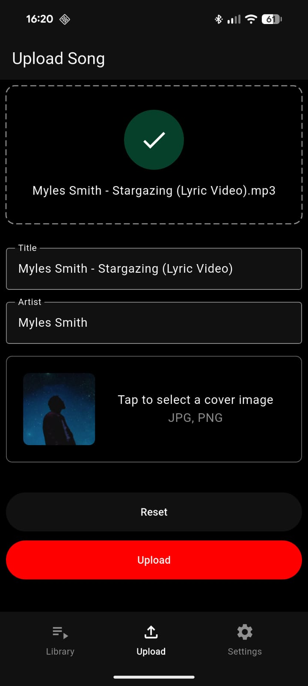
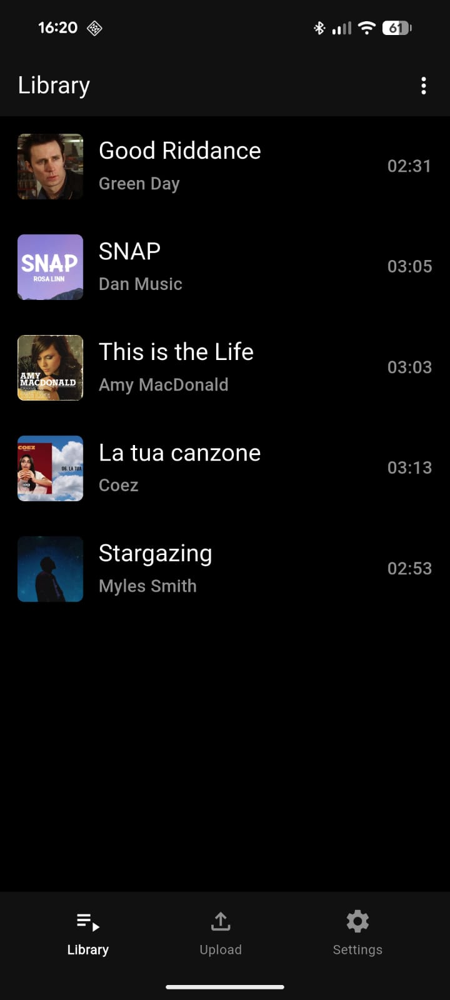
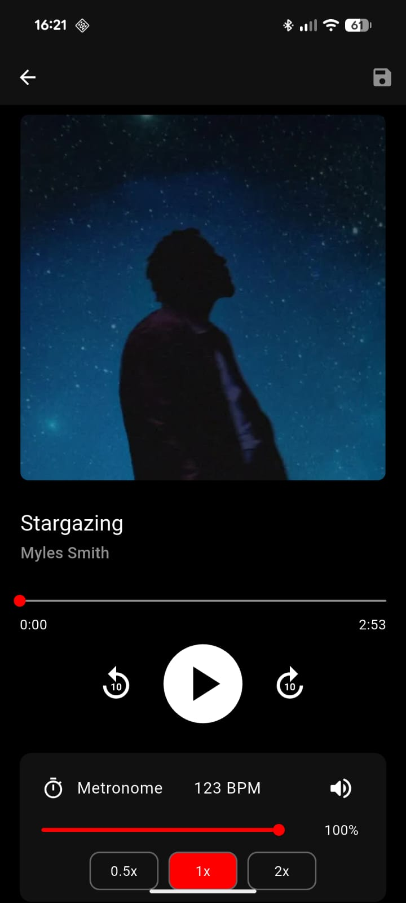
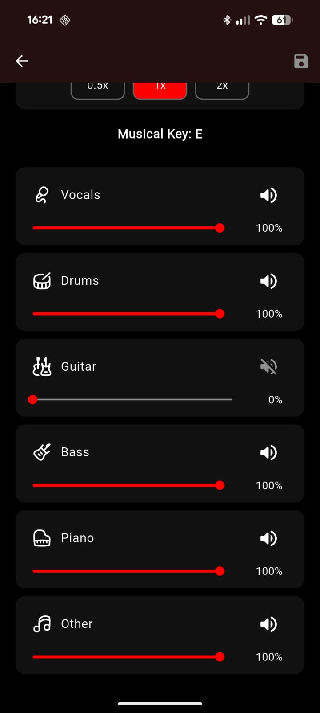

# 📱 Stemix Frontend

> **The Mobile Client side for Stemix.**

[](https://flutter.dev/)
[](https://dart.dev/)
[]()
[]()

## 📖 Overview

This repository contains the **Frontend** source code for **Stemix**, an educational musical tool built with **Flutter**. 

The app acts as the client interface that interacts with the [Stemix Backend](https://github.com/FrancescoLomastro/_stemix_backend). It allows users to upload songs, receive separated stems (processed by AI), and practice their instrument using a sophisticated multi-track mixer and synchronized metronome.

## Images
<p align="center">
  
  
  
  
</p>

## ✨ Key Features

* **🎛️ 6-Channel Mixer:** Real-time volume control for specific stems:
    * Vocals, Drums, Guitar, Bass, Piano, and Other.
* **⏱️ Smart Metronome:** * Synchronized click track.
    * Speed controls: `0.5x`, `1x`, `2x`.
* **📡 Server Configuration:** dedicated settings page to configure the backend IP and Port dynamically.
* **💾 Local Library:** Persist separated songs and metadata using a local SQLite database.
* **📱 Cross-Platform:** Optimized for both Android and iOS devices.

## 🛠️ Tech Stack & Libraries

This project uses a robust architecture based on modern Flutter standards:

* **Framework:** Flutter (Dart)
* **State Management:** [flutter_bloc](https://pub.dev/packages/flutter_bloc)
* **Audio Engine:** [flutter_soloud](https://pub.dev/packages/flutter_soloud) (Low latency audio processing)
* **Dependency Injection:** [get_it](https://pub.dev/packages/get_it) & [injectable](https://pub.dev/packages/injectable)
* **Database:** [drift](https://pub.dev/packages/drift) (SQLite abstraction)
* **Networking:** [dio](https://pub.dev/packages/dio)
* **Routing:** [go_router](https://pub.dev/packages/go_router)

## 🚀 Getting Started

### Prerequisites

* [Flutter SDK](https://docs.flutter.dev/get-started/install) (Version `^3.10.4` or higher)
* Android Studio or VS Code with Flutter extensions.
* A running instance of the **Stemix Backend**.

### Installation

1.  **Clone the repository:**
    ```bash
    git clone [https://github.com/FrancescoLomastro/_stemix_frontend.git](https://github.com/FrancescoLomastro/_stemix_frontend.git)
    cd _stemix_frontend
    ```

2.  **Install dependencies:**
    ```bash
    flutter pub get
    ```

3.  **Generate code (for Drift, Bloc, Injectable):**
    Since this project uses code generation, run the build runner:
    ```bash
    dart run build_runner build --delete-conflicting-outputs
    ```

4.  **Run the app:**
    ```bash
    flutter run
    ```

## ⚙️ Configuration

To make the app work, it must be connected to the Backend server (which performs the AI processing).

1.  Ensure your [Stemix Backend](https://github.com/FrancescoLomastro/_stemix_backend) docker container is running.
2.  Open the app on your physical device or emulator.
3.  Navigate to **Settings** -> **Server Address**.
4.  Enter the **IP Address** of your computer (where Docker backend is running) and the **Port** (default is `8080`).

